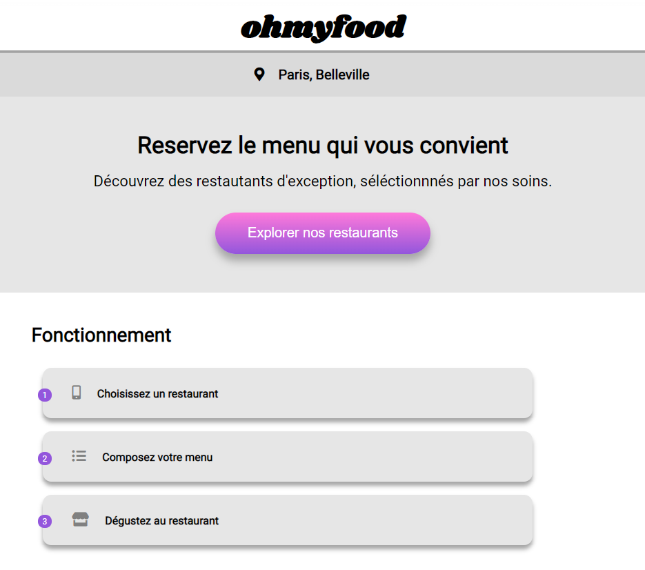
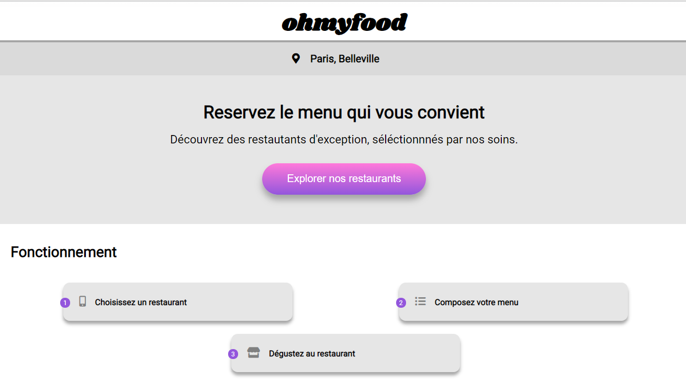
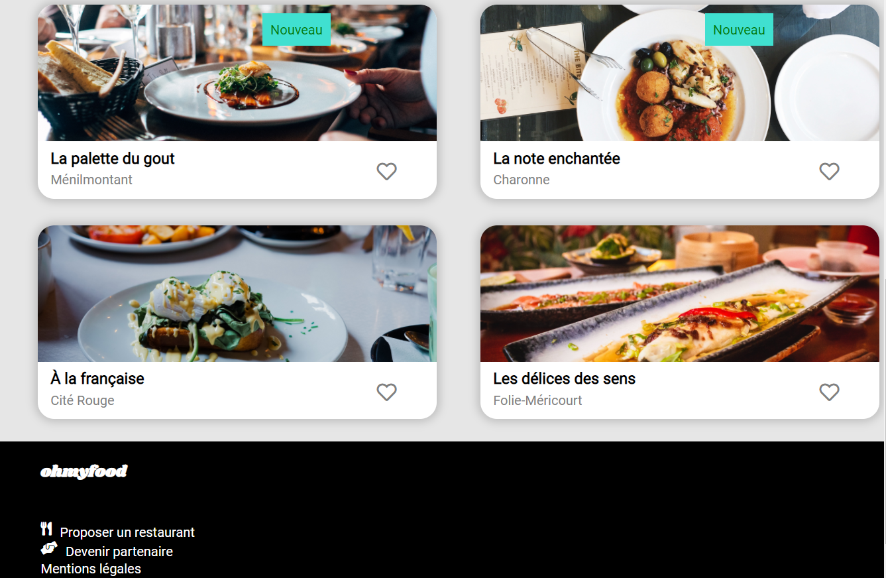
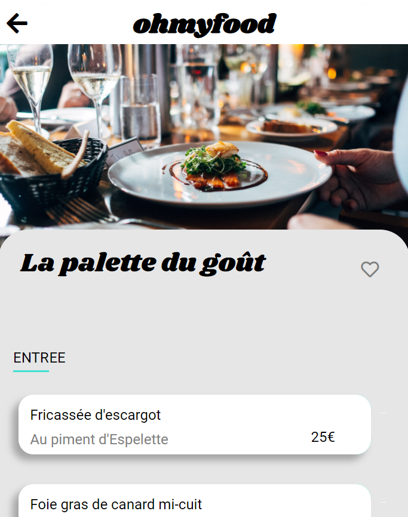

**Ohmyfood Projet de Formation**

>*Police : Shrikhand pour le logo et les titres
>*Police texte : Roboto

>*Couleurs :* 
                      
                      *Violet      (primaire)   #9356DC
                      *Rose        (secondaire) #FF79DA
                      *Turquoise   (tertiaire)  #99E2D0

>*Pas de javascript/pas de framework
>*Utilisation de SASS
>*Mobile First ---> Tablette et Desktop libre
>*W3C  validator HTML CSS sans erreur

*Page d’accueil  (x1)*

  

 >●Affichage de la localisation des restaurants. À terme il sera possible de choisir salocalisation pour trouver des restaurants proches d’un certain lieu.
 
 >●Une courte présentation de l’entreprise.
 

  

 >●Une section contenant les 4 menus sous forme cartes. Au clic sur la carte,l’utilisateur est redirigé vers la page du menu.
 

  

*Pages de menu (x4)*

 >●4 pages contenant chacune le menu d’un restaurant.
 
 *Footer*
 
 >●Le footer est identique sur toutes les pages.
 
 >●Au clic sur “Contact”, un renvoi vers une adresse mail est effectué.
 

  

*Header*
 
 >●Le header est présent sur toutes les pages.
 
 >●Sur la page d’accueil, il contient le logo du site.
 
 >●Sur les pages de menu, il contient en plus un bouton de retour vers la page d’accueil

 >*Les effets accessibles au clic ou au survol sont visibles sur la maquette*

*Boutons*
 
 >●Au survol, la couleur de fond des boutons principaux devra légèrement s’éclaircir.L’ombre portée devra également être plus visible.
 
 >●À terme, les visiteurs pourront sauvegarder leurs menus préférés. Pour ça, unbouton "J’aime" en forme de cœur est présent sur la maquette. Au clic, il devra seremplir progressivement. Pour cette première version, l’effet peut être apparaître ausurvol sur desktop au lieu du clic.
 
*Page d’accueil*

 >●Quand l’application aura plus de menus, un “loading spinner” sera nécessaire. Surcette maquette, nous souhaitons en avoir un aperçu. Il devra apparaître pendant 1 à3 secondes quand on arrive sur la page d'accueil, couvrir l'intégralité de l'écran, etutiliser les animations CSS (pas de librairie). Le design de ce loader n’est pas défini,toute proposition est donc la bienvenue tant qu’elle est cohérente avec la chartegraphique du site.

*Pages de menu*

 >●À l’arrivée sur la page, les plats devront apparaître progressivement avec un légerdécalage dans le temps. Ils pourront soit apparaître un par un, soit par groupe “Entrée”, “Plat” et “Dessert”. Un exemple de l’effet attendu est fourni.
 
 >●Le visiteur peut ajouter les plats qu'il souhaite à sa commande en cliquant dessus.Cela fait apparaître une petite coche à droite du plat. Cette coche devra coulisser dela droite vers la gauche. Pour cette première version, l’effet peut apparaître au survolsur desktop au lieu du clic. Si l’intitulé du plat est trop long, il devra être rogné avecdes points de suspension. Un exemple de l’effet attendu est fourni

    <video width="80%"  controls>
        <source src="animation.mp4" type="video/mp4">
    </video>

